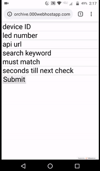

# Trainable-ESP8266

ESP8266 based LED strip display of Yes/No API data.

Example API queries:
Will it rain today? Have I reached my Kickstarter goals? Snow day? Good windspeed to fly drone? 

Change settings easily & remotely - by using web app.

Beat memory limits - by storing settings externally, served in sections.

Manage multiple devices

Optimized circuit efficiency by using 60 pure red, green, or blue WS2812B LEDs.

Cheap - parts cost < $10 US Dollars

# HowTo:
1. Parts Needed:
>Wemos D1 Mini - https://banggood.app.link/A4iiiWYPrW

>WS2812B Addressable 60 LED Strip - https://banggood.app.link/00UfnobQrW

>5V 2A Power Supply - **Must be at least 2 amps** I used a cut USB cable and a 2.1A USB Charger.  

2. Sign up for a free PHP web hosting service such as 000webhost.com and load the led.php file onto there. 

3. Download Python from https://www.python.org/downloads/ and be sure to enable install to path.

4. Open cmd.exe command line app.

5. Enter "pip install esptool" and follow prompts.

6. Enter ```cd C:\Users\g9duf\Desktop\micropython``` replacing path with the actual path to your micropython.bin file.

7. Enter ```esptool.py --chip esp8266 --port COM12 erase_flash``` replacing COM12 with the USB  your board is connected to.

8. Enter ```esptool.py --chip esp8266 --port COM12 write_flash -z 0x1000 micropython.bin``` replacing COM12 with the port your board is connected to.

9. In a text editor such as Notepad, open up main.py and input your building WiFi hotspot credentials and web hosting URL for led.php and hit save.

10. Connect to the mini WiFi hotspot broadcasted by the board and go to http://micropython.org/webrepl/ to load main.py onto the board.

11. Solder up your device.  
>D1 Mini ESP8266 5V---5V 2A Power---LED VCC

>D1 Mini ESP8266 GND---Ground 2A Power---LED Ground

>D1 Mini ESP8266 GPIO4(D2)---LED Strip Data In

>*Note: Some LED strips have additional wires for convenient power connection.

12. Edit the settings at your web hosting URL where led.php is located to program the device.
...


