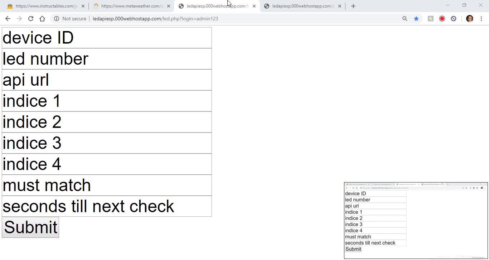

# ESP8266 - IoT Whiteboard Example

ESP8266 based LED strip display of Yes/No API data.

Example API queries:
Will it rain today? Have I reached my Kickstarter goals? Snow day? Good windspeed to fly drone? 

Change settings easily & remotely - by using web app.

Manage multiple devices

Optimized circuit efficiency by using 60 pure red, green, or blue WS2812B LEDs.

Cheap - parts cost < $10 US Dollars

# Tutorial:
## 1. Get Parts:
* Wemos D1 Mini - https://banggood.app.link/A4iiiWYPrW

* WS2812B Addressable 60 LED Strip - https://banggood.app.link/00UfnobQrW

* 5V 2A Power Supply - **Must be at least 2 amps.** - I used a cut USB cable and a 2.1A USB Charger.  

## 2. Install the Web App

Sign up for a free PHP web hosting service such as https://www.000webhost.com/ and load the led.php file onto there in the file manager area. 

## 3. Install Firmware

Open up UPyCraft and select board-->esp8266, select active USB port, and click burn firmware. Set flash erase-->on, custom firmware-->select your micropython.bin file you downloaded earlier and hit "flash".

## 4. Install the Script

In a text editor such as Notepad, open up connectWiFI.py and input your WiFi hotspot credentials and in main.py enter your web hosting URL for led.php and hit save. Add these files to the board's filesystem using UPyCraft

## 5. Solder up your device

Strip wire tips and tin with solder then fuse together.

>D1 Mini ESP8266 5V---5V 2A Power---LED VCC

>D1 Mini ESP8266 GND---Ground 2A Power---LED Ground

>D1 Mini ESP8266 GPIO4(D2)---LED Strip Data In

Wrap individual connections in electrical tape to insulate and prevent a short circuit.

**Note: Some LED strips have additional wires for convenient power connection**

## 6. Program the Device

Edit the settings at your web hosting URL where led.php is located to program the device.
...

## 7. Enjoy!

Here is a list of public APIs that you may be able to pull data from using this system:
https://github.com/toddmotto/public-apis

